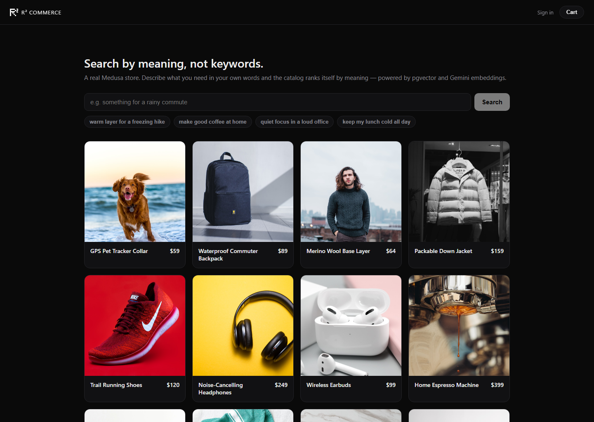

# R² Commerce

**A complete headless commerce store — with search by meaning, not keywords.**

R² is a real, shoppable [Medusa v2](https://medusajs.com) store: browse a catalog,
add to cart, check out, create an account, and see your order history. Its
signature feature is **semantic search** — type what you actually want ("warm
layer for a freezing hike", "make good coffee at home") and get the right products
back, even when none of those words appear in the product. Search is backed by
Postgres + [pgvector](https://github.com/pgvector/pgvector) and
[Gemini embeddings](https://ai.google.dev/gemini-api/docs/embeddings); the
storefront is [Next.js](https://nextjs.org) on top.

> Keyword search matches strings. This matches *intent*. "Quiet focus in a loud
> office" returns noise-cancelling headphones; "keep my lunch cold all day" returns
> the insulated bottle — by meaning, with a relevance cutoff so weak matches are
> dropped instead of padding the list.

**Live demo:** [shop.robinrahman.pro](https://shop.robinrahman.pro)



---

## Table of contents

- [Why this exists](#why-this-exists)
- [What's inside](#whats-inside)
- [How semantic search works](#how-semantic-search-works)
- [Architecture](#architecture)
- [Repository layout](#repository-layout)
- [Prerequisites](#prerequisites)
- [Quick start — the standalone engine](#quick-start--the-standalone-engine)
- [Full stack — Medusa backend + storefront](#full-stack--medusa-backend--storefront)
- [The search API](#the-search-api)
- [How auto-indexing works](#how-auto-indexing-works)
- [Storefront & commerce flow](#storefront--commerce-flow)
- [Emails & notifications](#emails--notifications)
- [Payments](#payments)
- [Analytics](#analytics)
- [Tech stack](#tech-stack)
- [Deployment](#deployment)
- [Limitations & roadmap](#limitations--roadmap)
- [Credits](#credits)

---

## Why this exists

Most store search is keyword search: it only finds products whose text literally
contains your words. Shoppers don't think in product titles — they describe a need.
Semantic search closes that gap by comparing the *meaning* of the query to the
*meaning* of each product, so descriptive, natural-language queries work.

R² wraps that idea in an actual store, so the feature has somewhere to live: a
catalog you can browse, a cart, a real checkout that produces orders, customer
accounts, and transactional email. The embedding pipeline, the vector index, the
auto-reindexing on product changes, and a clean search API are all here as a
working reference you can lift into a Medusa store.

## What's inside

A full commerce flow, not a search demo:

- **Catalog & product pages** — server-rendered from Medusa, live pricing and
  inventory, ISR-cached.
- **Semantic search** — natural-language ranking with a relevance threshold (the
  signature feature; details below).
- **Cart** — persistent cart with an add-to-cart drawer; survives reloads and
  attaches to the customer once they sign in.
- **Checkout** — multi-step (address → shipping → review → done) that creates a
  real Medusa order, with shipping options and a payment step.
- **Customer accounts** — register, sign in, and view order history.
- **Transactional email** — branded password-reset and order-confirmation emails
  via [Resend](https://resend.com).
- **Payments** — works out of the box with Medusa's manual provider; drop in
  [Stripe](https://stripe.com) by setting one env var.
- **Analytics** — [Vercel Web Analytics](https://vercel.com/analytics) plus
  optional [Google Analytics 4](https://analytics.google.com).
- **Admin dashboard** — the full Medusa backoffice at `/app` (products, orders,
  customers, inventory, shipping), branded with the R² mark.

## How semantic search works

1. **Embed.** Each product's `title + description` is sent to Gemini
   (`gemini-embedding-001`) and turned into a 768-dimensional vector — a numeric
   fingerprint of its meaning. The vector is stored in Postgres in a
   `product_embedding` table using the `vector` column type from pgvector.
2. **Index.** An [HNSW](https://github.com/pgvector/pgvector#hnsw) index with
   `vector_cosine_ops` makes nearest-neighbour lookups fast.
3. **Search.** A query is embedded the same way (with the `RETRIEVAL_QUERY` task
   type instead of `RETRIEVAL_DOCUMENT`), then products are ranked by **cosine
   similarity** using pgvector's `<=>` distance operator:

   ```sql
   SELECT product_id, 1 - (embedding <=> $1::vector) AS score
   FROM product_embedding
   ORDER BY embedding <=> $1::vector
   LIMIT $2;
   ```
4. **Filter.** Results below a similarity **threshold** (default `0.62`) are
   dropped, so a nonsense query returns "no strong matches" rather than the nearest
   of a bad bunch.

That's the whole idea. The rest is plumbing to keep the index in sync with the
store and to expose it cleanly.

## Architecture

The diagram traces the **search** path. The same storefront and backend also serve
catalog, cart, checkout, customer accounts, orders, payments, and email — see
[What's inside](#whats-inside).

```
                Shopper
                   │  query
                   ▼
  ┌────────────────────────────────┐
  │ Storefront (Next.js, :8000)    │
  │ /api/search  (server proxy)    │
  └────────────────┬───────────────┘
                   │ HTTP
                   ▼
  ┌────────────────────────────────┐
  │ Medusa backend (:9000)         │
  │ GET /semantic-search?q=...     │            ┌────────────────┐
  │ semantic-search module         │──embed()──▶│ Gemini API     │
  │ product.* subscribers          │            │ embeddings     │
  └────────────────┬───────────────┘            └────────────────┘
                   │
                   ▼
  ┌────────────────────────────────┐
  │ Postgres + pgvector            │
  │ product_embedding              │
  │ (HNSW cosine index)            │
  └────────────────────────────────┘
```

Every browser call — search, cart, checkout, auth — goes through a same-origin
Next.js route under `/api/*`, which proxies to the backend. That keeps the browser
CORS-free, hides the backend URL, and lets the server attach the publishable API
key and forward the customer's auth token.

## Repository layout

```
r2-commerce/
├── src/                      # Standalone engine (CLI) — the minimal reference
│   ├── catalog.ts            #   demo product list
│   ├── embed.ts              #   Gemini embedding + pgvector literal helper
│   ├── db.ts                 #   pg pool + schema (extension, table, HNSW index)
│   ├── index-catalog.ts      #   `pnpm index`  — embed + upsert the catalog
│   └── search.ts             #   `pnpm search` — embed a query, rank by cosine
│
├── medusa/                   # The real thing: a Medusa v2 monorepo (Turborepo)
│   └── apps/
│       ├── backend/          # Medusa server + admin
│       │   ├── medusa-config.ts          # modules: search, Redis, Stripe, Resend (all conditional)
│       │   ├── scripts/                   # postbuild: R² admin favicon
│       │   └── src/
│       │       ├── modules/semantic-search/  # search module (service + embed + schema)
│       │       ├── modules/resend/           # Resend notification provider + email templates
│       │       ├── subscribers/              # product.* → (re)index; order.placed / password_reset → email
│       │       ├── api/semantic-search/      # GET /semantic-search route
│       │       └── scripts/                  # seed, reindex, store/inventory/checkout setup (medusa exec)
│       └── storefront/       # Next.js store
│           └── app/
│               ├── store.tsx, product-card.tsx, products/[handle]/   # catalog + product pages
│               ├── cart-context.tsx, cart-drawer.tsx                 # cart
│               ├── checkout/                                          # multi-step checkout
│               ├── account/, auth-context.tsx                        # accounts + order history
│               └── api/                                              # same-origin proxy routes
│                   ├── search/ cart/ checkout/ orders/ auth/
│
├── DEPLOY.md                 # Railway + Vercel + Neon + Upstash, step by step
└── README.md
```

The **standalone engine** (`src/`) is the easiest way to see the core search idea
in isolation. The **Medusa stack** (`medusa/`) is the production-shaped version: a
full store where semantic search is a module that auto-syncs with the catalog.

## Prerequisites

- **Node.js 20+** (the engine is tested on 22).
- A **Postgres database with the `vector` extension available.**
  [Neon](https://neon.tech) free tier works out of the box (`CREATE EXTENSION
  vector` succeeds) and is what `DEPLOY.md` assumes.
- A **Gemini API key** from [Google AI Studio](https://aistudio.google.com/apikey).

> **Connection string note:** Medusa uses prepared statements, which break on
> PgBouncer-style pooled endpoints. Use Neon's **direct** (non-pooled) connection
> string for the Medusa backend. The standalone engine works with either.

## Quick start — the standalone engine

The fastest way to see semantic search working, no Medusa required.

```bash
# from the repo root
cp .env.example .env          # Windows: copy .env.example .env
#   DATABASE_URL=postgres://...        (your Neon string)
#   GOOGLE_GENERATIVE_AI_API_KEY=...   (Google AI Studio)

pnpm install
pnpm index                     # embeds the demo catalog into pgvector
pnpm search "something for a rainy commute"
pnpm search "make good coffee at home"
pnpm search "quiet focus in a loud office"
```

`.env.local` is also read if you prefer it. Example output:

```
Query: "something for a rainy commute"

1. Waterproof Commuter Backpack  ($89)  0.719
2. Noise-Cancelling Headphones   ($249) 0.627
3. Wireless Earbuds              ($99)  0.611
```

## Full stack — Medusa backend + storefront

The Medusa monorepo lives in `medusa/` and uses **npm**.

### 1. Install

```bash
cd medusa
npm install
```

### 2. Configure the backend

The backend reads its env from `medusa/apps/backend/.env`. The scaffold creates one
with `JWT_SECRET`, CORS, etc. Add your database and Gemini key:

```bash
# medusa/apps/backend/.env
DATABASE_URL=postgres://...        # Neon DIRECT (non-pooled) connection string
GOOGLE_GENERATIVE_AI_API_KEY=...
```

Optional integrations activate only when their env var is set (see the sections
below): `REDIS_URL`, `STRIPE_API_KEY`, `RESEND_API_KEY` + `RESEND_FROM`.

### 3. Migrate, seed, set up the store, create an admin

```bash
cd medusa/apps/backend

# create all Medusa tables (and the product_embedding table on first search)
npm run db:migrate

# create demo products (with prices) and embed them
npm run seed

# make products purchasable end to end: regions, inventory, shipping, payment
npx medusa exec ./src/scripts/setup-store.ts
npx medusa exec ./src/scripts/setup-inventory.ts
npx medusa exec ./src/scripts/setup-checkout.ts
npx medusa exec ./src/scripts/link-shipping-profile.ts

# optional: re-embed every existing product (after model/schema changes)
npm run reindex

# create an admin login for the dashboard
npm run user -- -e you@example.com -p yourpassword
```

### 4. Run

```bash
# from medusa/apps/backend
npm run dev                 # backend + admin on http://localhost:9000  (admin at /app)
```

```bash
# from medusa/apps/storefront, in another terminal
npm run dev                 # storefront on http://localhost:8000
```

The storefront proxies to the backend at `http://localhost:9000` by default; set
`MEDUSA_BACKEND_URL` in `medusa/apps/storefront/.env.local` to point elsewhere.

Open **http://localhost:8000**, type a phrase, and watch products rank by meaning —
then add it to the cart and check out. Add or edit a product in the admin
(`:9000/app`) and it becomes searchable automatically — see below.

## The search API

```
GET /semantic-search?q=<query>&threshold=<0..1>&limit=<n>
```

| Param       | Default | Notes                                              |
| ----------- | ------- | -------------------------------------------------- |
| `q`         | —       | Required. Natural-language query.                  |
| `threshold` | `0.62`  | Minimum cosine similarity to count as a match.     |
| `limit`     | `8`     | Max results (capped at 20).                        |

Example:

```bash
curl "http://localhost:9000/semantic-search?q=warm%20layer%20for%20a%20freezing%20hike"
```

```json
{
  "query": "warm layer for a freezing hike",
  "threshold": 0.62,
  "count": 2,
  "results": [
    { "id": "prod_...", "title": "Merino Wool Base Layer", "description": "...", "price": 64,  "score": 0.7436 },
    { "id": "prod_...", "title": "Packable Down Jacket",   "description": "...", "price": 159, "score": 0.6988 }
  ]
}
```

`price` is the lowest USD variant price (or `null` if the product has none),
resolved through Medusa's product→pricing module link. `score` is cosine
similarity in `0..1`.

## How auto-indexing works

The index stays in sync with the store through Medusa **subscribers** — no manual
reindexing in normal use:

| Event                              | Subscriber           | Action                                  |
| ---------------------------------- | -------------------- | --------------------------------------- |
| `product.created`, `product.updated` | `product-embed.ts`   | embed `title + description`, upsert vector |
| `product.deleted`                  | `product-delete.ts`  | delete the product's vector             |

So when a store owner adds a product in the admin, it's findable by meaning within
seconds, with zero extra steps. The `seed-products.ts` script also embeds directly
for a deterministic first load.

## Storefront & commerce flow

The storefront is a Next.js App Router app. Server components fetch catalog and
product data through `lib/medusa.ts`; client interactivity (cart, auth) lives in
React contexts. Every backend call is proxied through a same-origin route under
`app/api/*`, which attaches the publishable API key and forwards the signed-in
customer's bearer token — so the browser never sees the backend URL or the key.

- **Cart** (`cart-context.tsx`, `cart-drawer.tsx`) — line items persist via a cart
  id in `localStorage` and re-associate with the customer on login.
- **Checkout** (`checkout/page.tsx`) — address → shipping option → review →
  complete. Completing the cart creates a Medusa order; the proxy creates the
  payment collection and session, then completes the cart.
- **Accounts** (`account/page.tsx`, `auth-context.tsx`) — email/password register
  and login against Medusa's customer auth, plus order history.

## Emails & notifications

Transactional email is sent through [Resend](https://resend.com) via a custom
Medusa **notification provider** (`src/modules/resend`). It's gated on
`RESEND_API_KEY` — without it, Medusa logs notifications locally (fine for dev).

| Trigger event          | Subscriber           | Email                                  |
| ---------------------- | -------------------- | -------------------------------------- |
| `auth.password_reset`  | `password-reset.ts`  | branded reset link (admin or customer) |
| `order.placed`         | `order-placed.ts`    | order confirmation with line items     |

```bash
# medusa/apps/backend/.env (or your host's env)
RESEND_API_KEY=re_...
RESEND_FROM=R² Commerce <noreply@yourdomain.com>
MEDUSA_BACKEND_URL=https://your-backend-domain      # builds the admin reset link
STOREFRONT_URL=https://your-storefront-domain       # builds the customer reset link
```

Templates are plain inline HTML (`src/modules/resend/emails.ts`), so the backend
build stays dependency-light. The provider resolves a template by name and skips
unknown ones instead of failing the event that emitted them.

## Payments

Checkout works out of the box with Medusa's built-in **manual** provider
(`pp_system_default`) — real orders, no payment account needed. The storefront
also has a full **Stripe card** flow (Stripe Elements on the review step), which
turns on automatically when both keys are present:

- `STRIPE_API_KEY` (backend) — registers the Stripe provider (`pp_stripe_stripe`).
- `NEXT_PUBLIC_STRIPE_PUBLISHABLE_KEY` (storefront) — switches checkout to the card
  form. Without it, checkout falls back to the manual provider.

Two more steps to take live card payments:

1. **Enable Stripe for your region** in the admin (Settings → Regions → your region
   → Payment Providers → check **Stripe**).
2. **Add a Stripe webhook** so capture/refund/failure sync back to Medusa:
   - Endpoint: `https://<your-backend>/hooks/payment/stripe_stripe`
   - Put the signing secret in `STRIPE_WEBHOOK_SECRET` (backend).

> The webhook path is **`stripe_stripe`**, not `stripe`. The provider is configured
> with `id: "stripe"`, so its Medusa id is `pp_stripe_stripe`, and the hook route
> rebuilds the provider id as `pp_{path}` — so the path segment must be
> `stripe_stripe`. A `…/stripe` endpoint resolves to `pp_stripe` and silently drops
> every event.

The flow authorizes the card at checkout, then captures on order capture
(admin "Capture payment" or fulfillment); the webhook keeps Stripe and Medusa in
sync. Test card `4242 4242 4242 4242`, any future expiry, any CVC.

## Analytics

The storefront ships with two analytics layers, both in `app/layout.tsx`:

- **Vercel Web Analytics** (`@vercel/analytics`) — always on when deployed to
  Vercel, no key needed.
- **Google Analytics 4** (`@next/third-parties`) — loads only when
  `NEXT_PUBLIC_GA_ID` is set, so it stays off until you provide a measurement id.

## Tech stack

- **[Medusa v2](https://medusajs.com)** — commerce backend (products, pricing,
  carts, orders, customers, payments, admin, events) and the
  module/subscriber/API framework.
- **PostgreSQL + [pgvector](https://github.com/pgvector/pgvector)** — vector
  storage and HNSW cosine nearest-neighbour search.
- **[Gemini embeddings](https://ai.google.dev/gemini-api/docs/embeddings)**
  (`gemini-embedding-001`, 768-dim) — meaning vectors for products and queries.
- **[Next.js](https://nextjs.org)** — the storefront and its same-origin API proxy.
- **[Resend](https://resend.com)** — transactional email.
- **[Stripe](https://stripe.com)** (optional) — card payments.
- **[Vercel Analytics](https://vercel.com/analytics)** + **Google Analytics 4** —
  traffic and behaviour.
- **TypeScript**, **node-postgres (`pg`)**, **Turborepo**.

## Deployment

See **[DEPLOY.md](./DEPLOY.md)** for a step-by-step split deploy:

- **Backend → [Railway](https://railway.app)** (always-on Node server; serves the
  admin at `/app`)
- **Storefront → [Vercel](https://vercel.com)** (CDN, free tier)
- **Database → [Neon](https://neon.tech)**, **Redis → [Upstash](https://upstash.com)**

Both tiers run on custom domains (API + admin on one subdomain, storefront on
another) behind automatic TLS. Optional features turn on purely by setting env
vars on the host: `REDIS_URL`, `STRIPE_API_KEY`, `RESEND_API_KEY` / `RESEND_FROM`,
and `NEXT_PUBLIC_GA_ID` on the storefront.

## Limitations & roadmap

This is a focused reference implementation. Known gaps, roughly in priority order:

- The `/semantic-search` route is **unauthenticated and public**. It's rate
  limited per IP (30 req/min, in-memory), but for real traffic you'd also move it
  under `/store` (publishable API key) and back the limiter with Redis.
- The relevance `threshold` is a single global constant; per-category tuning or a
  relative cutoff would be better.
- No hybrid search yet — combining semantic ranking with keyword/filter (price,
  brand, in-stock) would beat either alone.
- Embeddings are computed one product at a time; batch embedding would speed up
  large catalogs.
- The storefront has no customer-facing password-reset *page* yet (the reset email
  links there); the admin reset flow is complete.

## Credits

Built by [Robin](https://github.com/rob0pup). Semantic-search engine, Medusa
modules, and storefront are original work; Medusa, pgvector, Gemini, and Resend do
the heavy lifting underneath.
